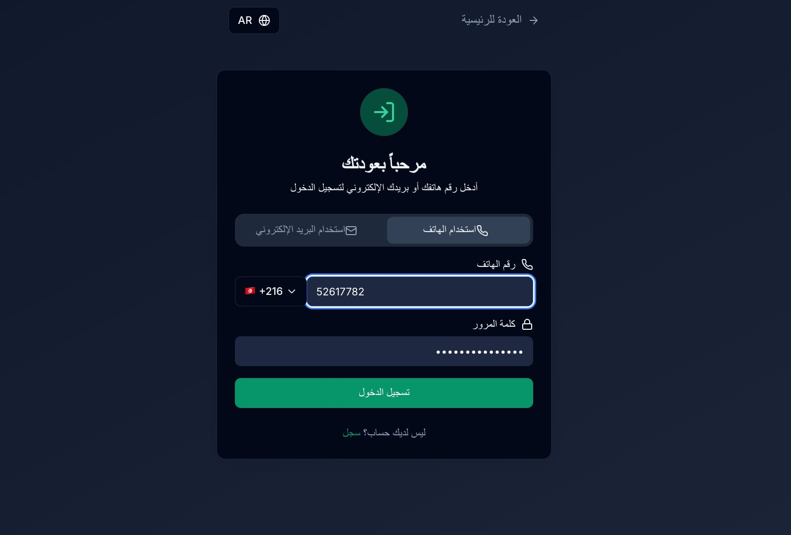
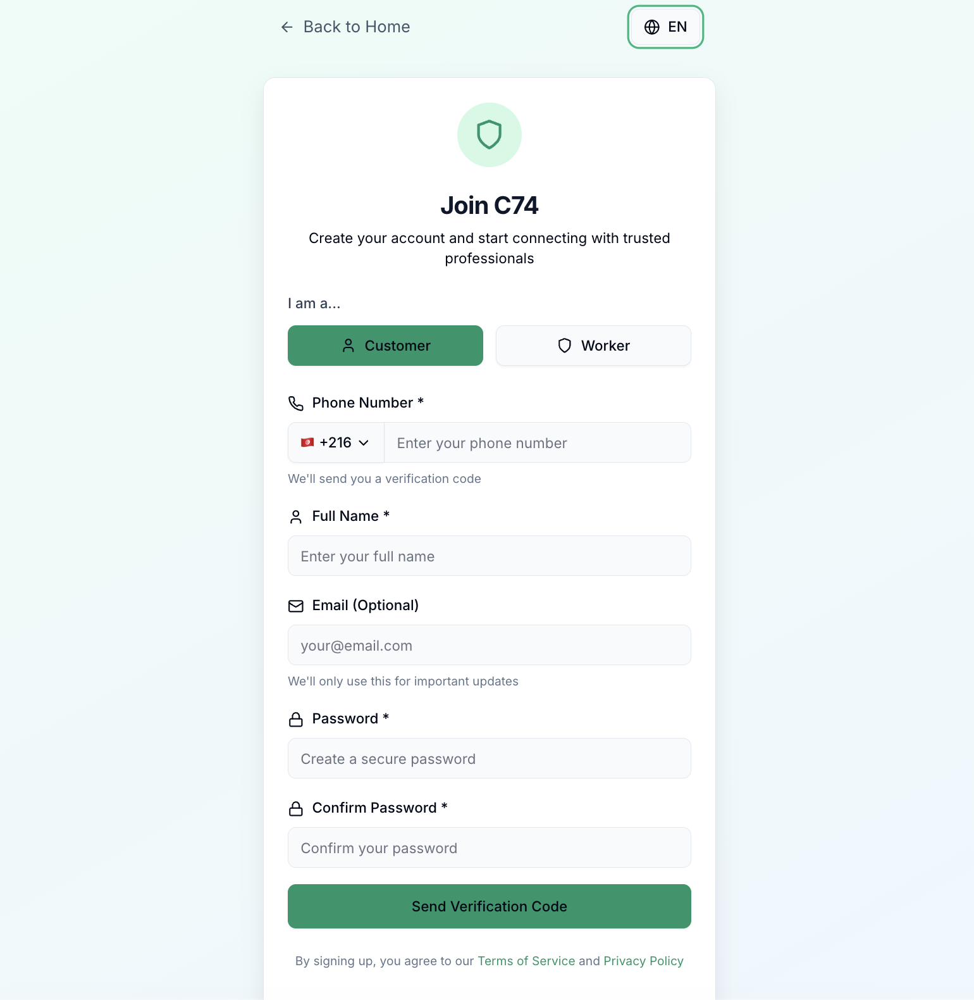
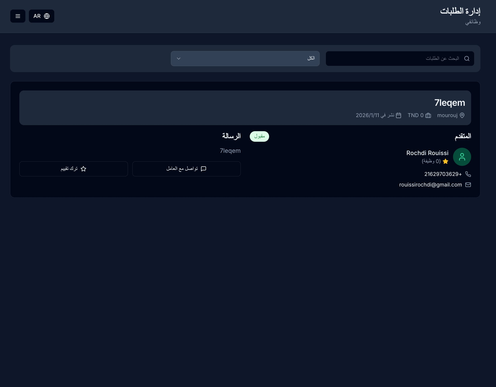

# Worker Marketplace Platform

A comprehensive Next.js-based worker marketplace platform connecting customers with verified service professionals.

## 📸 Screenshots

### **Home Page**


### **Authentication**



### **Customer Features**


### **Worker Features**




## 🚀 Features

### **Customer Features**
- Browse and search verified workers by category
- Filter workers by location, rating, and availability
- Create job offers and negotiate pricing
- Real-time messaging with workers
- Job tracking and completion management
- Review and rating system

### **Worker Features**
- Professional profile creation with onboarding
- Availability calendar management
- Job application and bidding system
- Real-time customer messaging
- Earnings dashboard and analytics
- Document verification system

### **Admin Features**
- Worker approval and verification workflow
- Dispute resolution management
- Fee collection and financial oversight
- Platform analytics and reporting
- User management and moderation

## 🛠 Tech Stack

- **Frontend:** Next.js 13 (App Router), React, TypeScript
- **UI:** Tailwind CSS, ShadCN/UI Components
- **Database:** Supabase (PostgreSQL)
- **Authentication:** Custom JWT with OTP verification
- **Internationalization:** next-intl (Arabic, English, French)
- **State Management:** React Hooks, Context API
- **API:** Next.js API Routes, RESTful design

## 📱 Supported Languages

- 🇹🇳 Arabic (Tunisia) - Primary
- 🇬🇧 English
- 🇫🇷 French

## 🏗 Architecture

### **Project Structure**
```
src/
├── app/                    # Next.js App Router pages
│   ├── [locale]/          # Internationalized routes
│   ├── api/               # API endpoints
│   └── (auth)/            # Authentication pages
├── components/            # Reusable UI components
│   ├── ui/               # Base UI components
│   ├── pages/            # Page-specific components
│   └── worker/           # Worker-specific components
├── lib/                  # Utility libraries
├── hooks/                # Custom React hooks
├── types/                # TypeScript type definitions
└── styles/               # Global styles
```

### **Database Schema**
- **Users & Authentication:** Multi-role user system
- **Workers:** Professional profiles and verification
- **Jobs:** Service requests and management
- **Messages:** Real-time communication
- **Reviews:** Rating and feedback system
- **Payments:** Fee collection and transactions

## 🚀 Getting Started

### **Prerequisites**
- Node.js 18+ 
- npm or yarn
- Supabase account

### **Installation**

1. **Clone the repository**
```bash
git clone https://github.com/bedouifedy-oss/worker-marketplace.git
cd worker-marketplace
```

2. **Install dependencies**
```bash
npm install
```

3. **Set up environment variables**
```bash
cp .env.example .env.local
```

4. **Configure Supabase**
```bash
# Run migrations in Supabase SQL Editor
supabase/migrations/*.sql
```

5. **Start development server**
```bash
npm run dev
```

6. **Open [http://localhost:3000](http://localhost:3000)**

## ⚙️ Environment Variables

```env
NEXT_PUBLIC_SUPABASE_URL=your_supabase_url
NEXT_PUBLIC_SUPABASE_ANON_KEY=your_supabase_anon_key
SUPABASE_SERVICE_ROLE_KEY=your_service_role_key
```

## 📱 User Roles

### **Customer**
- Browse and hire workers
- Create and manage jobs
- Communicate with workers
- Leave reviews and ratings

### **Worker**
- Create professional profile
- Set availability and pricing
- Apply for jobs and negotiate
- Manage earnings and schedule

### **Admin**
- Approve worker applications
- Resolve disputes
- Manage platform operations
- Access analytics and reports

## 🔐 Authentication Flow

1. **Signup:** Phone number required for OTP verification
2. **Login:** Email OR phone + password
3. **OTP:** 6-digit code sent via SMS
4. **Verification:** Secure session establishment

## 🌍 Internationalization

- **RTL Support:** Full Arabic RTL layout
- **Dynamic Routing:** Locale-based URLs (`/ar-TN/`, `/en/`, `/fr/`)
- **Content Translation:** All UI text translated
- **Date/Time Formatting:** Locale-specific formatting

## 📊 Key Features Implemented

### **Real-time Features**
- ✅ Live messaging system
- ✅ Real-time job status updates
- ✅ Instant notifications

### **Advanced Filtering**
- ✅ Multi-criteria worker search
- ✅ Location-based filtering
- ✅ Rating and availability filters

### **Payment System**
- ✅ Platform fee collection
- ✅ Worker payment processing
- ✅ Financial reporting

### **Admin Tools**
- ✅ Worker verification workflow
- ✅ Dispute resolution system
- ✅ Analytics dashboard

## 🤝 Contributing

1. Fork the repository
2. Create a feature branch (`git checkout -b feature/amazing-feature`)
3. Commit your changes (`git commit -m 'Add amazing feature'`)
4. Push to the branch (`git push origin feature/amazing-feature`)
5. Open a Pull Request

## 📄 License

This project is licensed under the MIT License - see the [LICENSE](LICENSE) file for details.

## 🙏 Acknowledgments

- Built with [Next.js](https://nextjs.org/)
- UI components by [ShadCN/UI](https://ui.shadcn.com/)
- Database by [Supabase](https://supabase.com/)
- Styling by [Tailwind CSS](https://tailwindcss.com/)

## 📞 Support

For support and questions:
- Create an issue in this repository
- Contact the development team

---

**Built with ❤️ for the Tunisian marketplace**
